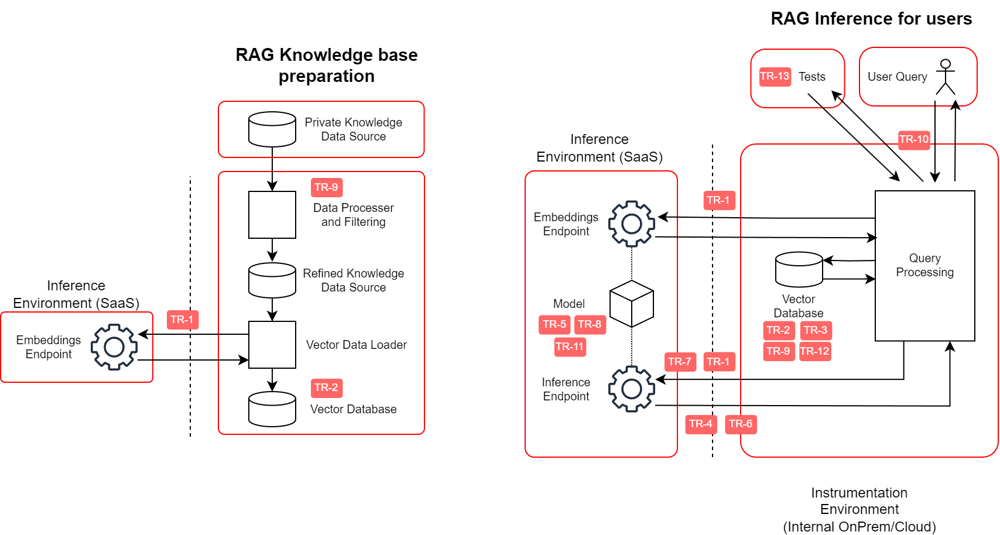

This document describes a simple AI system consisting of a Large Language Model with Retrieval Augmented Generation (RAG) using an external SaaS for inference. This is being used as a vehicle for developing a governance framework for on-boarding GenAI technology, and should be considered an early stage draft document.

## Introduction

The rapid advancements in Artificial Intelligence (AI), particularly Generative AI, are set to revolutionize both business operations and personal lives. In the financial services sector, these innovations present immense opportunities that span product offerings, client interactions, employee productivity, and organizational operations. Few technologies have promised such a broad and transformative impact.

However, these advancements also bring significant challenges. Issues like hallucinations, prompt injections, and model unpredictability introduce unique complexities to safely integrate and deploy AI technologies. The pace of technological change means that today's solutions may become obsolete tomorrow, necessitating a flexible yet robust governance approach.

Financial institutions (in particular) are eager to onboard, experiment with, and deploy AI technologies to stay both competitive and innovative. Yet, the risk landscape and regulatory environment of the financial services industry necessitates proper governance. Existing processes/frameworks may not be adequately equipped to address the novel challenges posed by AI, particularly Generative AI. Therefore, there is a critical need for an adaptive governance framework that promotes the safe, trustworthy, and compliant adoption of AI technologies.

### Value Proposition

The *AI Readiness Governance Framework* aims to bridge the gap between the transformative potential of AI and the stringent requirements of the financial services industry. By providing a structured approach to identifying, assessing, and mitigating risks associated with AI systems, the framework empowers organizations to harness AI's benefits while maintaining compliance with regulatory standards and safeguarding against operational risks.

- For *Technical Teams*, the AI Readiness Governance Framework can offer developers a clear set of guidelines and best practices for integrating AI technologies into existing systems. This can improve risk mitigation by identifying potential risks early in the development cycle, promoting robust and secure AI solutions.
- For *CISOs and Risk Management teams*, the AI Readiness Governance Framework can work to establish an early-stage 'toolbox' to evaluate the security implications of AI technologies. This helps to ensure that AI implementations align with organizational policies and regulatory requirements.
- For *Heads of AI and CTO/CIO Offices*, the AI Readiness Governance Framework provides benefit to aligning AI initiatives with the organization's strategic objectives and technological roadmap. In turn, this can improve resource optimization and ROI with respect to investments in AI development/adoption.
- For *Vendors and Service Providers*, the AI Readiness Governance Framework can aide in understanding the governance expectations of financial institutions and build trust with clients by demonstrating adherence with an established framework.

### Intended Audience

As briefly touched upon in the Value Proposition, this framework is designed for a broad range of stakeholders involved in the adoption and governance of AI technologies within the financial services industry. See the list below for a high-level outline of potential stakeholders.

- **Financial Services CISOs and Risk Management Teams**: Responsible for assessing and mitigating security risks, ensuring data confidentiality, integrity, and availability.
- **Policy Control Offices**: Tasked with developing and enforcing policies governing AI technology use in compliance with regulatory standards.
- **CTO/CIO Offices (Architecture and Development Teams, Data/Model Acquisition and Management Teams)**: Overseeing the integration of AI systems into the organization's technological infrastructure.
- **Vendor Solution Teams (Third-Party Vendors)**: Aligning AI products and services with the governance standards required by financial institutions.
- **Vendor Purchasing Teams**: Evaluating and procuring AI technologies that meet governance and compliance criteria.
- **Model Risk Management Teams**: (May not be in direct scope but considered for future roadmap) Assessing risks associated with AI models and their deployment.
- **Banking Legal Teams**: Understanding the legal implications of deploying AI technologies and ensuring adherence to laws and regulations.
- **Industry Regulators**: Gaining insights into industry best practices for AI governance within financial services, facilitating informed regulatory oversight.
- **Cloud Service Providers (CSPs) and Model Providers**: Tailoring offerings to meet the stringent governance requirements of financial institutions.
- **Other Open Source Providers**: Including organizations like the Cloud Computing Caucus (CCC) and others, to collaborate and integrate governance best practices across platforms.

## Initial scope - RAG-based Q&A

While the ultimate goal is to develop a comprehensive governance framework that can accommodate a wide variety of use cases, starting with a narrowly focused, well-defined initial scope offers several advantages. By selecting a common, high-impact use case that financial organizations frequently encounter, we can create immediate value and demonstrate the effectiveness of our approach. This smaller, more manageable scope will allow for a quicker implementation and iteration process, enabling us to refine our framework based on real-world experience. Additionally, focusing on a use case that can be open-sourced not only fosters collaboration but also ensures that the framework is adaptable and beneficial to a broader community. This initial effort will serve as a foundation for developing a robust governance structure that can be scaled and expanded to cover a wide range of applications in the future.

**In Scope (for now)**:

 - An architecture based on a Generative AI Large Language Model.
 - System composed of a SaaS inference endpoint external to the organization.
 - Usage of Retrieval Augmented Generation (RAG), to provide a knowledge base custom to the organization.
 - Users are internal to the organization. They interact with the system through a UI and are responsible for how they use the provided information.

**Out of Scope (for now)**:

 - Pre-trained model (open source or not) that the organization deploys on its own infrastructure.
 - Fine tunning of a model (be it open source, or SaaS).
 - AI agents collaborating.
 - User interacting with the model is external to the organization.
 - User is not first responsible for action, but the AI model, being it completely independent, or having light supervision.
 - Most safety/bias consideration are out of scope for the first version of the governance framework, but will be considered later as it is one of the objectives for the group in general.
 - Small models that are very specialized, and are updated continuosly depending on the data being feeded (example models for organizing cache in a bigger system).

**Assumptions**: 

- We can rely upon the operational controls in place in the organisaton already. Financial industry standard existing governance is assumed for the infrastructure, supply chain, and application code.
- The system has an auditor, and its result/actions has potential legal implications.
- Users of this system have responsibility for their actions.
- Mitigation steps for ethical and responsibility concerns are the remit of the application developer and its data's classifications.
- The system's metadata/metrics/logs to audit the accuracy and bias of this system are known and have an existing process.
- Carbon outputs and system cost are intertwined, but these are the responsibility of app/system developers.

## Metadata

Each Threat or Control has a status which indicates its current level of maturity:

<table>
  <thead>
    <tr>
      <th>Status</th>
      <th>Description</th>
    </tr>
  </thead>
  <tbody>
    
    <tr>
      <td>{{ status.name }}</td>
      <td>{{ status.description }}</td>
    </tr>
    
  </tbody>
</table>

## Contents

### Threats

<table>
  <thead>
    <tr>
      <th>ID</th>
      <th>Status</th>
      <th>Title</th>
    </tr>
  </thead>
  <tbody>
  
    <tr>
      <td><a href="#TR-{{ threat.sequence }}">TR-{{ threat.sequence }}</a></td>
      <td>{{ threat.doc-status }}</td>
      <td>{{ threat.title }}</td>
    </tr>
  
  </tbody>
</table>

### Controls

<table>
  <thead>
    <tr>
      <th>ID</th>
      <th>Status</th>
      <th>Title</th>
    </tr>
  </thead>
  <tbody>
  
    <tr>
      <td><a href="#CT-{{ control.sequence }}">CT-{{ control.sequence }}</a></td>
      <td>{{ control.doc-status }}</td>
      <td>{{ control.title }}</td>
    </tr>
  
  </tbody>
</table>

## Threats


<h3 id="TR-{{ threat.sequence }}">TR-{{ threat.sequence }} - {{ threat.title }}</h3>
<dl>
  <dt>Document Status</dt>
  <dd>{{ threat.doc-status }}</dd>
  <dt>Threat Type</dt>
  <dd>{{ threat.type | join: ', ' }}</dd>
</dl>

{{ threat.content | markdownify }}



## Controls


<h3 id="CT-{{ control.sequence }}">CT-{{ control.sequence }} - {{ control.title }}</h3>
<dl>
  <dt>Document Status</dt>
  <dd>{{ control.doc-status }}</dd>
  <dt>Control Type</dt>
  <dd>{{ control.type | join: ', ' }}</dd>
  <dt>Mitigates</dt>
    <dd>
      <ul>
        
        <li><a href="#{{ mitigant | upcase }}">{{ mitigant | upcase }}</a></li>
        
      </ul>
    </dd>
</dl>

{{ control.content | markdownify }}



